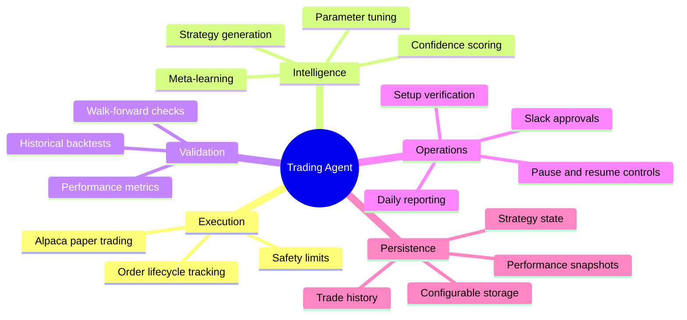
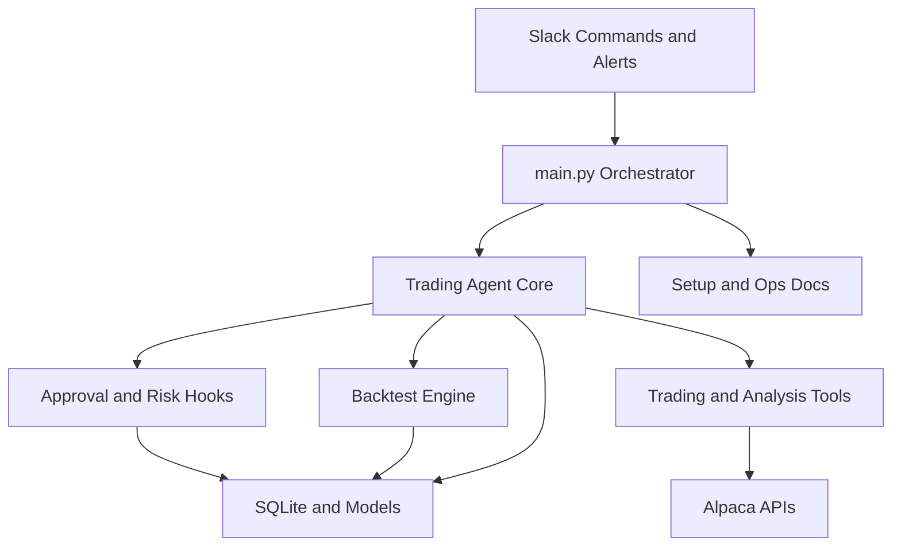
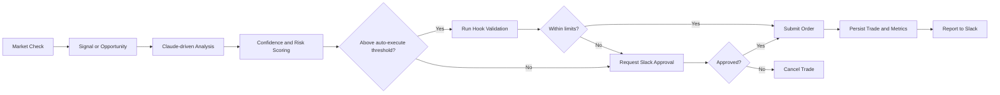
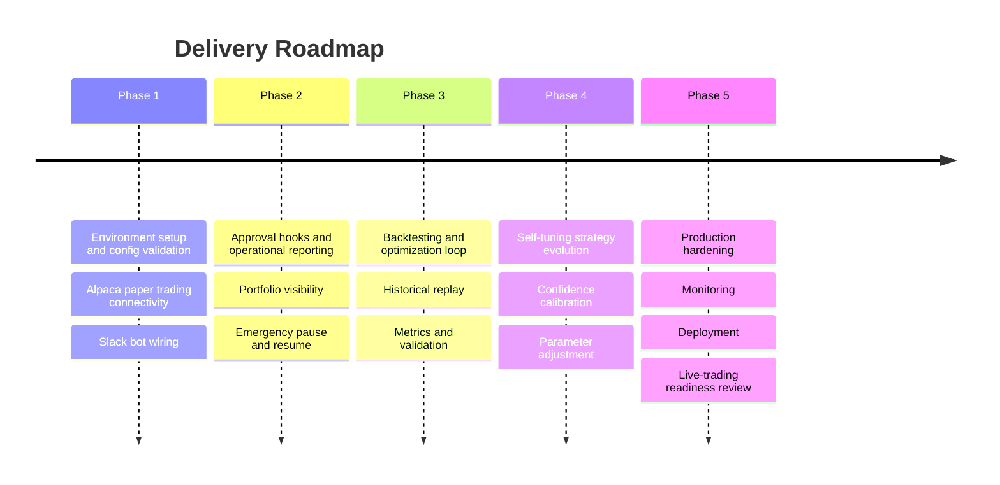

# Trading Agent Plan

This document turns the current repository into a clear delivery plan. It is based on the code and docs already present in `trading_agent/`, while also outlining the work needed to move from a local prototype to a safely operated autonomous trading system.

## Goals

- Build a reliable paper-trading agent before any live deployment
- Keep human approval in the loop until confidence and risk controls prove stable
- Create a repeatable cycle of strategy generation, backtesting, evaluation, and rollout
- Make operations observable through Slack reports, alerts, and emergency controls

## Product Scope

## System Architecture

## Trading Decision Flow

## Delivery Phases

## Phase Breakdown

### Phase 1. Baseline readiness

- Validate config loading, environment variables, and startup behavior
- Confirm Alpaca paper trading connectivity
- Verify database creation and storage models
- Run setup verification and document any missing local prerequisites

### Phase 2. Safe operations

- Make Slack alerts and interactive approvals dependable
- Ensure risk limits gate execution consistently
- Add clear operational status, portfolio, and health reporting
- Keep emergency stop paths simple and testable

### Phase 3. Validation engine

- Strengthen historical data ingestion and replay
- Produce consistent backtest outputs and performance summaries
- Add walk-forward validation and comparison reporting
- Define clear promotion criteria from backtest to paper trading

### Phase 4. Adaptive intelligence

- Improve confidence calibration against realized outcomes
- Tune thresholds and position sizing based on rolling performance
- Track strategy variants and retire underperforming behavior
- Build a measured evolution cadence rather than constant churn

### Phase 5. Production hardening

- Add deployment and runtime monitoring guidance
- Improve failure handling for network, broker, and Slack outages
- Define audit trails for decisions and approvals
- Create a checklist for any future live-trading transition

## Milestones and Exit Criteria

| Milestone | Exit Criteria |
| --- | --- |
| Paper trading ready | Config loads cleanly, broker connection works, trades can be simulated safely |
| Ops ready | Slack alerts, approvals, reporting, and pause flow are verified |
| Backtest ready | Historical runs are reproducible and performance metrics are trustworthy |
| Adaptive ready | Threshold tuning is measurable and bounded by risk constraints |
| Deployment ready | Monitoring, documentation, and recovery procedures are in place |

## Risks to Manage

- Overconfident autonomous execution before validation is mature
- Incomplete market-data coverage during backtests
- Slack or broker outages interrupting approvals or reporting
- Strategy drift that improves recent results but weakens robustness
- Configuration mistakes leaking secrets or enabling live trading too early

## Recommended Near-Term Priorities

1. Keep the system in paper trading mode and verify the current setup end to end.
2. Exercise the approval flow and Slack reporting until the operator experience feels predictable.
3. Tighten the backtesting loop so strategy changes always have measurable evidence behind them.
4. Only then widen autonomous execution thresholds and consider deployment hardening.
